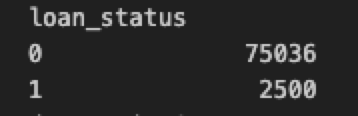
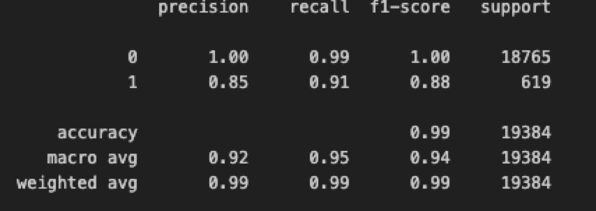

## Overview of the Analysis

**Purpose**
The purpose of this analysis is to utilize loan data to create a machine learning model to identify creditworthiness of borrowers. 

**Dataset**
The dataset used contains historical loan information from a financial institution. This information includes:

  - Loan Size
  - Interest Rate
  - Borrower Income
  - Debt to Income
  - Number of Accounts
  - Derogatory Marks
  - Total Debt
  - Loan Status 

**Goal**
Based on the loan information, the goal is to create a model that will predict `Health Loans - 0` vs `High-Risk Loans - 0`.

**Process Steps**

1. The loan data from the CSV was imported, and a dataframe was created with each column of information

2. The data was then split into `X` and `y`variables. The `y` variable contains the labels, and `X` contains the features (the rest of the columns in the DataFrame).

  - This step is necessary in preparing the data for further analysis by categorizing first into 0 - healthy and 1 - High Risk. 

3. After splitting out the labels and features, `value_counts` was used to determine the balance of the data that will be used for the machine learning model. This function provided the counts for `0 - Healthy` and `1 - High Risk` loans in the dataset.
    

4. Next, the data was split into training and testing sets. Splitting this data is a necessary step in order to train the model, and then evaluate the accuracy of the model predictions using the testing data. 

5. The fit() function was used to fit a `Logistic Regression` model to our dataset. This model works for the loan data, as it predicts binary outcomes. In this scenario, the outcomes can either be 0 or 1. 

6. The testing data labels were then used to make predictions on the trained model. 

7. With the prediction, the output was used to generate results on the accuracy and success of the model 

## Results

* Machine Learning Model 1: `Logistic Regression`

Based on the precision of the model, the calculation for 0 (healthy loan) is 1.00 which means it's almost always correct in identifying predicted positive observations to the total predicted positive observations.

For 1 (high-risk loan), the ratio is 0.85, which means it is slightly less accurate in correctly identifying predictive positive observations.

When comparing the precision to the overall accuracy and ratio of all predicted observations for each label, it is an indicator that the model is performing well.

  

## Summary

In Summary, while the LogisticRegression model performed well in this instance, and had an overall high accuracy, I would not recommend using this model for the lending dataset, without first balancing the data.

There is a limitation in that the model is biased because the ratio of healthy to high risk loans is highly unbalanced. In this scenario, using RandomOverSampler before doing Logistic Regression improves the accuracy of the model because it oversamples (includes more of) the minority class in the dataset, better training the model. 

The performance of the model does depend on the problem that we are trying to solve for. In this example there are clearly defined categories for Healthy vs High Risk. It is important to predict both `0`'s and `1`'s because accurately predicting these means that the training for the model is accurate, *but* the `1 - High Risk` group is more important because poor model accuracy and precision can have a great impact on a financial institution if they are lending to high-risk borrowers. 

